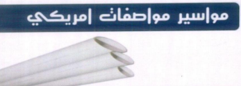

<!DOCTYPE html>
<html lang="ar" dir="rtl">
<head>
    <meta charset="UTF-8">
    <meta name="viewport" content="width=device-width, initial-scale=1.0">
    <title>جاد ثيرم - للصناعات البلاستيكية والمعدنية</title>
    
    <!-- استدعاء خط تجوال -->
    <link href="https://fonts.googleapis.com/css2?family=Tajawal:wght@400;500;700;900&display=swap" rel="stylesheet">
    
    <!-- استدعاء مكتبة الأيقونات Font Awesome -->
    <link rel="stylesheet" href="https://cdnjs.cloudflare.com/ajax/libs/font-awesome/6.4.0/css/all.min.css">

    
</head>
<body>

    <header>
        <h1><i class="fa-solid fa-industry"></i> GAD-THERM</h1>
        
شركة جاد ثيرم لأنظمة المياه والصرف - قمة التكنولوجيا الألمانية

        
<i class="fa-solid fa-shield-halved"></i> ضمان خمسين عاماً | قائمة أسعار 2026

    </header>

    <!-- أزرار الأقسام -->
    

        <button class="tab-btn active" onclick="openTab('gawan', this)">
            <i class="fa-solid fa-ring"></i> قائمة أسعار الجوان
        </button>
        <button class="tab-btn" onclick="openTab('poly', this)">
            <i class="fa-solid fa-pipe"></i> قائمة أسعار البولي
        </button>
        <button class="tab-btn" onclick="openTab('white', this)">
            <i class="fa-solid fa-droplet"></i> قائمة أسعار الأبيض
        </button>
    

    <!-- قسم الجوان -->
    

        <!-- المنتج الأول كمثال -->
        

            

                
            

            

                <h3>كوع عادة 90</h3>
                

                    <table>
                        <thead>
                            <tr>
                                <th>المقاس</th>
                                <th>1</th>
                                <th>2</th>
                                <th>3</th>
                                <th>4</th>
                                <th>6</th>
                            </tr>
                        </thead>
                        <tbody>
                            <tr>
                                <td><strong>السعر</strong></td>
                                <td>22</td>
                                <td>40</td>
                                <td>45</td>
                                <td>84.2</td>
                                <td>189</td>
                            </tr>
                        </tbody>
                    </table>
                

            

        

        <!-- يمكنك نسخ ولصق كود المنتج المطور هنا لباقي منتجات الجوان -->
    

    <!-- قسم البولي -->
    

        <!-- المنتج الأول كمثال -->
        

            

                
            

            

                <h3>مواسير اخضر ضغط 20 بار</h3>
                

                    <table>
                        <thead>
                            <tr>
                                <th>المقاس</th>
                                <th>السعر</th>
                            </tr>
                        </thead>
                        <tbody>
                            <tr>
                                <td>م . ماسورة ض 2020</td>
                                <td>28.30</td>
                            </tr>
                            <tr>
                                <td>م ماسورة 20y/25</td>
                                <td>55.00</td>
                            </tr>
                        </tbody>
                    </table>
                

            

        

    

    <!-- قسم الأبيض -->
    

         <!-- المنتج الأول كمثال -->
         

            

                
            

            

                <h3>مواسير مواصفات امريكي</h3>
                

                    <table>
                        <thead>
                            <tr>
                                <th>المقاس</th>
                                <th>السعر</th>
                            </tr>
                        </thead>
                        <tbody>
                            <tr>
                                <td>1 بوصة 4 مللى</td>
                                <td>58</td>
                            </tr>
                            <tr>
                                <td>2 بوصة 4 مللى</td>
                                <td>112</td>
                            </tr>
                        </tbody>
                    </table>
                

            

        

    

    <!-- الفوتر المطور -->
    <footer>
        <h4><i class="fa-solid fa-building"></i> جاد ثيرم للصناعات البلاستيكية والمعدنية</h4>
        

            
<i class="fa-solid fa-location-dot"></i> المحلة الكبرى - منشية البكري

            
<i class="fa-solid fa-phone"></i> 01559558978

            
<i class="fa-solid fa-globe"></i> www.gadtherm.net

        

    </footer>

    <!-- سكربت التحكم في الأقسام -->
    
</body>
</html>
